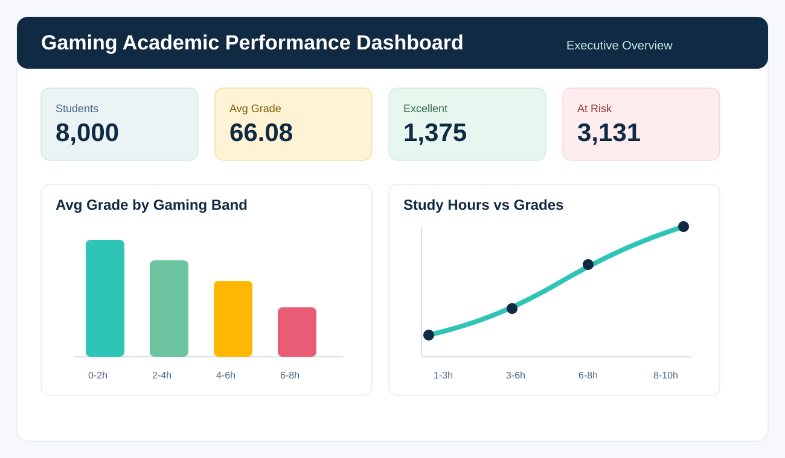

<div align="center">


# Gaming Academic Performance - Student Behavior Intelligence

**Analisis de habitos de gaming, estudio, descanso y rendimiento academico**  
*Construido con Power Query - Excel - MySQL - Power BI-ready - SQL Analytics*

<br/>

[](https://powerquery.microsoft.com/)
[](https://www.mysql.com/)
[](https://powerbi.microsoft.com/)

<br/>

> "No todas las horas de pantalla pesan igual: el valor analitico esta en entender cuando el gaming compite con el estudio, el sueno y la asistencia."

</div>

---

## Contexto del Proyecto

Una institucion academica quiere entender como los habitos digitales de sus estudiantes se relacionan con el rendimiento. El dataset combina horas de gaming, horas de estudio, sueno, asistencia, uso de dispositivos, tiempo de reaccion, nivel de estres y calificaciones.

El objetivo del proyecto es transformar un CSV crudo en un flujo analitico reproducible: limpieza en Power Query, dataset final en Excel, consultas SQL reutilizables en MySQL y una estructura lista para construir un dashboard en Power BI.

---

## Dashboard - 4 Paginas

| Pagina | Nombre | Pregunta que responde |
|--------|--------|-----------------------|
| **P1** | Executive Overview | Como se distribuye el rendimiento academico general? |
| **P2** | Gaming vs Study Trade-off | A partir de que intensidad de gaming baja la calificacion promedio? |
| **P3** | Student Behavior Intelligence | Que patrones aparecen entre sueno, asistencia, dispositivos y estres? |
| **P4** | Risk & Opportunity Segments | Que estudiantes requieren intervencion academica o seguimiento? |

<br/>

<div align="center">

<br/><sub><i>Blueprint visual para Power BI - Paleta academica navy #102A43, teal #2EC4B6 y amber #FFB703</i></sub>
</div>

---

## Arquitectura

```text
FUENTE DE DATOS
   data/gaming_academic_performance.csv
   8,000 estudiantes - 14 variables originales
           |
           v
LIMPIEZA / TRANSFORMACION
   Power Query
   PowerQuery/gaming_academic_cleaning.pq
   - normalizacion de texto
   - correccion de valores fuera de rango
   - columnas derivadas para segmentacion
           |
           v
DATASET FINAL
   data/Desempeño_académico_limpio.xlsx
   8,000 estudiantes - 19 columnas limpias
           |
           v
ALMACENAMIENTO ANALITICO
   MySQL
   SQL/gaming_academic_queries.sql
   - 16 queries analiticos
   - 3 vistas para dashboard
           |
           v
VISUALIZACION
   Power BI / Excel
   - KPIs
   - segmentos
   - ranking
   - correlaciones
```

---

## Datos

Esta seccion resume los dos archivos de datos usados en el proyecto.

| Archivo | Descripcion | Filas | Columnas |
|---------|-------------|------:|---------:|
| `data/gaming_academic_performance.csv` | Dataset original sin transformar | 8,000 | 14 |
| `data/Desempeño_académico_limpio.xlsx` | Dataset limpio y transformado en Power Query | 8,000 | 19 |

Flujo de datos:

```text
gaming_academic_performance.csv
        |
        v
Power Query
        |
        v
Desempeño_académico_limpio.xlsx
```

---

## Limpieza y Transformacion

La limpieza principal fue realizada en **Power Query**. El archivo con los pasos en lenguaje M queda en:

```text
PowerQuery/gaming_academic_cleaning.pq
```

Resumen del proceso:

| Paso | Resultado |
|------|-----------|
| Carga del CSV original | 8,000 filas y 14 columnas |
| Revision de nulos | 0 valores nulos |
| Limpieza de texto | Normalizacion de `gender`, `stress_level` y conservacion de siglas `FPS` / `RPG` |
| Renombrado de columna | `attendance` pasa a llamarse `attendance (%)` en el archivo limpio de Power Query |
| Correccion de `grades` | Valores acotados al rango 0-100 |
| Correccion de `addiction_score` | Valores negativos acotados a 0 |
| Columnas agregadas | `gaming_band`, `study_band`, `sleep_band`, `performance_band`, `risk_flag` |
| Dataset final | 8,000 filas y 19 columnas |

---

## Diccionario de Columnas

El detalle completo de columnas, tipos sugeridos, valores categoricos, reglas de limpieza y columnas derivadas esta documentado en [`data/data_dictionary.md`](data/data_dictionary.md).

Resumen rapido:

| Elemento | Detalle |
|----------|---------|
| Columnas originales | 14 |
| Columnas finales | 19 |
| Columna renombrada | `attendance` pasa a `attendance (%)` en Power Query / Excel |
| Columnas derivadas | `gaming_band`, `study_band`, `sleep_band`, `performance_band`, `risk_flag` |

---

## Metricas Implementadas

| Metrica | Definicion | Uso en dashboard |
|---------|------------|------------------|
| **Grade Average** | Promedio de calificaciones limpias | KPI principal de rendimiento |
| **At-Risk Students** | Estudiantes con `grades < 60` | Seguimiento academico |
| **Excellent Students** | Estudiantes con `grades >= 90` | Identificacion de mejores practicas |
| **Gaming Hours** | Horas diarias de gaming | Intensidad de juego |
| **Study Hours** | Horas diarias de estudio | Disciplina academica |
| **Sleep Hours** | Horas diarias de sueno | Balance de rutina |
| **Attendance** | Porcentaje de asistencia, columna `attendance (%)` en Power Query | Compromiso academico |
| **Addiction Score** | Indice de dependencia al gaming | Riesgo conductual |
| **Device Usage** | Uso diario de dispositivos | Exposicion digital |
| **Reaction Time** | Tiempo de reaccion en milisegundos | Indicador cognitivo operativo |

---

## SQL Analytics - 16 Queries + 3 Views

```sql
-- Ejemplo: calificacion promedio por banda de gaming
SELECT
    gaming_band,
    COUNT(*) AS students,
    ROUND(AVG(grades), 2) AS avg_grade,
    ROUND(AVG(study_hours), 2) AS avg_study_hours,
    ROUND(AVG(addiction_score), 2) AS avg_addiction_score
FROM gaming_academic_performance
GROUP BY gaming_band
ORDER BY MIN(gaming_hours);
```

| Seccion SQL | Queries | Tecnicas utilizadas |
|-------------|---------|---------------------|
| KPIs Ejecutivos | Q1-Q4 | `AVG`, `COUNT`, `CASE WHEN`, agregaciones condicionales |
| Rendimiento Academico | Q5-Q8 | segmentacion, ranking, performance bands |
| Inteligencia de Comportamiento | Q9-Q12 | correlaciones calculadas, `NTILE`, agregaciones |
| Riesgo y Calidad de Datos | Q13-Q16 | segmentos, revision de rangos, vistas para BI |
| ETL Views | 3 vistas | `CREATE OR REPLACE VIEW`, tablas listas para dashboard |

Nota: en el archivo limpio de Power Query la columna aparece como `attendance (%)`. En el script SQL se usa `attendance` como nombre tecnico para evitar espacios y parentesis en las consultas.

---

## Estructura del Repositorio

```text
Gaming_Academic_Performance_Analysis-Q1/
|
|-- data/
|   |-- gaming_academic_performance.csv
|   |-- Desempeño_académico_limpio.xlsx
|   `-- data_dictionary.md
|
|-- SQL/
|   `-- gaming_academic_queries.sql
|
|-- PowerQuery/
|   `-- gaming_academic_cleaning.pq
|
|-- assets/
|   |-- header_banner.svg
|   `-- dashboard_preview.svg
|
|-- .gitignore
`-- README.md
```

---

## Como Reproducir

### 1. Generar dataset limpio en Power Query

1. Abrir Excel o Power BI.
2. Importar `data/gaming_academic_performance.csv`.
3. Entrar a **Power Query**.
4. Aplicar los pasos documentados en `PowerQuery/gaming_academic_cleaning.pq`.
5. Cargar la tabla limpia como `data/Desempeño_académico_limpio.xlsx`.

### 2. Crear tabla en MySQL

Para cargar en MySQL, exportar la hoja limpia desde Excel como CSV y luego usar MySQL Workbench con **Table Data Import Wizard**.

Alternativa con SQL:

```sql
LOAD DATA LOCAL INFILE 'data/gaming_academic_performance_clean.csv'
INTO TABLE gaming_academic_performance
FIELDS TERMINATED BY ','
ENCLOSED BY '"'
LINES TERMINATED BY '\n'
IGNORE 1 ROWS;
```

### 3. Conectar a Power BI

```text
Get Data -> MySQL
Server: localhost
Database: [tu_db]
Importar:
  - gaming_academic_performance
  - vw_kpis_academicos
  - vw_student_segments
  - vw_behavior_dashboard
```

---

## Insights Clave del Analisis

- El dataset fuente contiene **8,000 estudiantes**, **14 columnas** y no presenta valores nulos.
- La limpieza en Power Query genera un archivo limpio de **19 columnas** sin eliminar filas.
- Despues de la limpieza, `grades` queda dentro del rango **0-100** y `addiction_score` queda con minimo **0**.
- Las **horas de estudio** son la variable con relacion positiva mas fuerte frente a calificaciones (`corr = 0.733`).
- Las **horas de gaming** muestran una relacion negativa relevante con calificaciones (`corr = -0.552`).
- Estudiantes con **0-2h de gaming** tienen calificacion promedio de **82.02**, frente a **49.38** en el grupo de **6-8h**.
- Estudiantes con **8-10h de estudio** alcanzan promedio de **88.66**, frente a **44.91** en el grupo de **1-3h**.
- Hay **3,131 estudiantes en riesgo academico** (`grades < 60`) y **1,375 estudiantes excelentes** (`grades >= 90`).

---

## Autor

**Nicolás Ospina Polanía**  
Data Analyst Jr. en formacion

**Stack principal:** Power Query - Excel - Power BI - SQL/MySQL

---

<div align="center">

*Proyecto construido como repositorio de portafolio academico a partir de un unico dataset CSV.*

</div>

